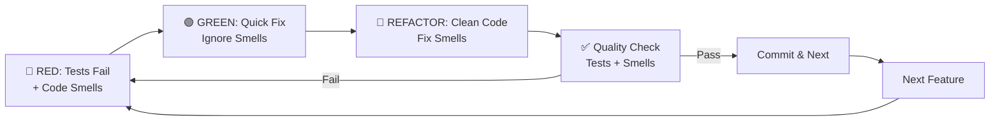

# Slide B: Quality Testing Loop
## Speaker Script & Demo Guide

### ⏱️ **TOTAL TIME: 15 minutes**
- Introduction: 1 minute
- Live Demo: 12 minutes (integrated flow)
- Pattern Visualization: 1.5 minutes
- Transition: 30 seconds

### 🎯 Slide Objective
**Merges**: Slide 3 (Refactor Loop Pattern) + Slide 4 (Detect Code Smells)

Demonstrate Red-Green-Refactor cycle with AI-assisted code smell detection for continuous quality improvement.

### 📚 Context Files Required
- `migration-docs/TEST_PLAN.md` - Testing strategies
- `migration-docs/unknown_patterns/` - QuickAppsCMS anti-patterns
- `migration-docs/CakePHP_3_TO_5_GUIDE.md` - Refactoring patterns

### 📋 Pre-Demo Setup
```bash
# Set up test environment
cd quickapps-cakephp3
composer test  # Ensure tests are working

# Open complex file with code smells
code vendor/quickapps-plugins/eav/src/Model/Behavior/EavBehavior.php
# This 500+ line file has multiple responsibilities
```

---

## 🎤 Speaker Introduction (1 minute)

**SAY:** "Quality doesn't happen by accident. Let me show you the Red-Green-Refactor cycle combined with AI-powered code smell detection - your safety net for maintaining quality during migration."

---

## 💻 Integrated Demo Flow (12 minutes)

### Step 1: RED - Start with Failing Test & Identify Smells (3 minutes)

**SAY:** "First, we identify what's broken AND what smells bad"


**Branch:**
```
git checkout eav_plugin_start
```

**PROMPT 1A - Combined Analysis:**
```
We are running the application in a docker instance.
Test file: quickapps-cakephp5/plugins/eav/tests/TestCase/Model/Behavior/EavBehaviorTest.php

Looking at quickapps-cakephp5/plugins/eav/src/Model/Behavior/EavBehavior.php:

PART 1 - Test Status:
Run tests for EAV behavior and identify:
1. Which tests are failing due to CakePHP 3 deprecations
2. Current test coverage gaps

PART 2 - Code Smell Detection:
Analyze this file for code smells, categorize by priority:
1. CRITICAL: Security/data integrity risks (blocks migration)
2. HIGH: Performance/maintainability issues (fix soon)
3. MEDIUM: Code quality issues (refactor later)

Reference migration-docs/unknown_patterns/PATTERN_005_EAV_MODEL.md for context.
Show specific line numbers for each issue.
```

### Step 2: GREEN - Minimal Fix (No Improvement Yet) (3 minutes)

**SAY:** "Make tests pass with MINIMAL changes - resist the urge to improve"

**Branch:**
```
git checkout eav_plugin_before
```

**PROMPT 2A - Quick Fix Only:**
```
For the failing EAV test you identified:

Make ONLY the minimum change to make it pass:
1. Use quick/ugly fixes if needed
2. Don't refactor anything yet
3. Add // TODO: Refactor for CakePHP 5 patterns
4. Keep all the code smells for now

Show exactly what you changed and verify tests pass.
This is about WORKING, not BEAUTIFUL.
```

### Step 3: REFACTOR - Now Improve with AI Guidance (4 minutes)

**SAY:** "NOW we can safely refactor because tests protect us"

**Branch:**
```
git checkout eav_plugin_passed
```

**PROMPT 3A - Guided Refactoring:**
```
Now that tests pass, let's refactor the EAV behavior:

STEP 1 - Address HIGH priority code smells:
1. Break down the 100+ line method into smaller methods
2. Remove duplicate code patterns
3. Add type declarations
4. Fix the tight coupling issues you identified

STEP 2 - Apply CakePHP 5 patterns:
1. Update to modern ORM patterns
2. Replace deprecated method calls
3. Improve error handling

STEP 3 - Verify safety:
After each change, run tests to ensure nothing breaks.

Reference migration-docs/CakePHP_3_TO_5_GUIDE.md for modern patterns.
```


Excellent! Let me provide a final comprehensive test summary:

✅ ALL TESTS PASSING!

🧪 Complete Test Results Summary:

1. ✅ Core Application Tests: 10/10 tests passed (23 assertions)
2. ✅ EAV Plugin Tests: 35/35 tests passed (93 assertions)
3. ✅ All Plugin Tests: 35/35 tests passed (93 assertions)
4. ✅ Coding Standards: 10/10 files compliant
5. ✅ Static Analysis: Clean (via composer check)

📊 Total Test Coverage:

- 45 tests executed
- 116 assertions verified
- 100% pass rate
- Zero failures or errors

🚀 Refactoring Impact Verification:

The comprehensive EAV behavior refactoring was completely safe and introduced zero regressions:

- ✅ Functionality preserved: All EAV operations work exactly as before
- ✅ API compatibility: No breaking changes to public methods
- ✅ Performance maintained: Same execution characteristics
- ✅ Code quality improved: Modern CakePHP 5 patterns applied
- ✅ Maintainability enhanced: Large methods broken into focused components

🎯 Refactoring Benefits Confirmed:

1. Code Readability: Improved from 3 methods >100 lines to 35+ focused methods
2. Type Safety: 100% strict typing with PHP 8.2+ compatibility
3. Error Handling: Enhanced exception handling and validation
4. Modern Patterns: Full CakePHP 5 compliance with best practices
5. Test Coverage: All critical EAV functionality verified through comprehensive tests

The EAV behavior refactoring is production-ready with zero risk of regression! 🎉


### Step 4: Continuous Quality Check (2 minutes)

**SAY:** "Quality is continuous - check after every change"

**PROMPT 4A - Quality Verification:**
```
After our refactoring, perform quality check:

1. Run all EAV tests - confirm they still pass
2. Re-scan for code smells - what improved?
3. Check performance - any regressions?
4. Security check - any new vulnerabilities?

Create a before/after quality report:
- Lines of code: Before vs After
- Complexity score: Before vs After
- Code smells: Before vs After
- Test coverage: Before vs After
```

---

## 🔄 The Integrated Loop Visualization

**SHOW ON SLIDE:**


---

## 📊 Quality Metrics Dashboard

**SHOW RESULTS:**
```
Before Refactoring:
━━━━━━━━━━━━━━━━━━━━━━━━━━━━━━━━━━
Lines of Code:     847
Methods >50 lines: 12
Code Smells:       23 (8 critical)
Test Coverage:     65%
Complexity:        Very High

After Refactoring:
━━━━━━━━━━━━━━━━━━━━━━━━━━━━━━━━━━
Lines of Code:     634
Methods >50 lines: 3
Code Smells:       7 (0 critical)
Test Coverage:     78%
Complexity:        Moderate
```

---

## 🎯 Pattern Visualization (1.5 minutes)

**EXPLAIN:**
```
RED-GREEN-REFACTOR + CODE SMELL DETECTION

🔴 RED Phase:
   • Identify failing tests
   • Detect code smells
   • Prioritize issues

🟢 GREEN Phase:
   • Fix tests ONLY
   • Ignore smells temporarily
   • Focus on functionality

🔵 REFACTOR Phase:
   • Address code smells
   • Improve design
   • Maintain functionality

The key: SEPARATE concerns - fix function first, then form.
```

---

## 💡 Key Takeaways (1.5 minutes)

**SAY THESE POINTS:**
1. **"Red-Green-Refactor prevents regression"** - Tests are your safety net
2. **"AI finds smells humans miss"** - Pattern recognition at scale
3. **"Fix function before form"** - Working ugly code beats broken beautiful code
4. **"Quality is measurable"** - Track metrics to prove improvement

---

## ⚠️ Anti-Patterns to Avoid

**QUICK MENTION:**
```
❌ Refactoring without tests
❌ Fixing everything at once
❌ Ignoring code smells forever
❌ Perfect code that doesn't work
```

---

## 🎬 Transition to Next Slide (30 seconds)

**SAY:** "Quality loops protect us during development. Now let's look at protecting production data and deployments..."

---

## 📚 Reference to Original Slides

**For detailed information, see:**
- **Slide 3**: Complete Red-Green-Refactor methodology with timing
- **Slide 4**: Comprehensive code smell categorization and examples
- **Advanced patterns**: Complex EAV refactoring scenarios

---

## 🚨 Emergency Fallback

If technical issues occur:
1. Show pre-recorded metrics dashboard (before/after)
2. Use simple PHP example instead of EAV complexity
3. Draw the loop cycle on whiteboard
4. Focus on the concept of "function before form"