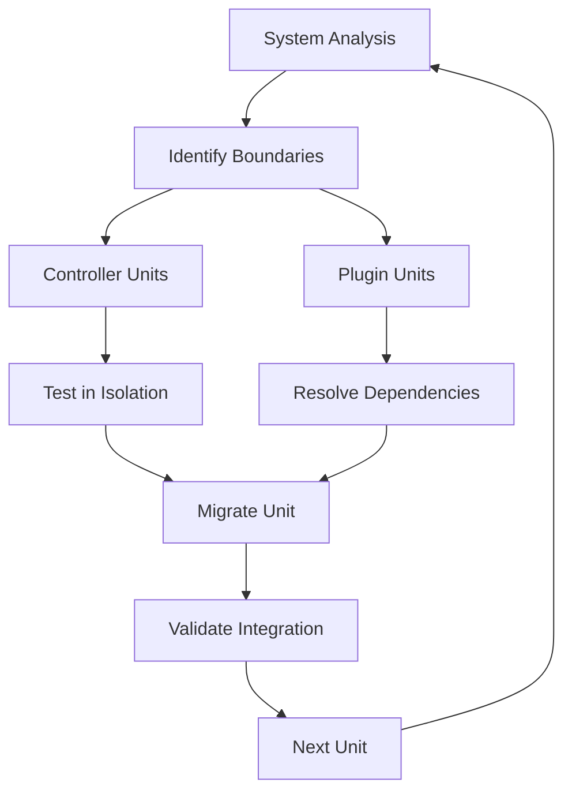

# Slide D: Component Migration Strategy
## Speaker Script & Demo Guide

### ⏱️ **TOTAL TIME: 12 minutes**
- Introduction: 1 minute
- Live Demo: 9.5 minutes (integrated flow)
- Migration Order: 1 minute
- Transition: 30 seconds

### 🎯 Slide Objective
**Merges**: Slide 7 (Controller-by-Controller Migration) + Slide 13 (Safe Plugin Migration)

Demonstrate how to break down complex systems into manageable migration units using natural boundaries.

### 📚 Context Files Required
- `migration-docs/CONTROLLERS_DEPENDENCY_MAP.md` - Controller hierarchy
- `migration-docs/PLUGINS_DEPENDENCY_MAP.md` - Plugin dependency graph
- `migration-docs/DEPENDENCY_MATRIX.md` - Detailed dependencies

### 📋 Pre-Demo Setup
```bash
# Analyze system complexity
cd quickapps-cakephp3
find vendor/quickapps-plugins/ -name "*Controller.php" | wc -l  # Count controllers
ls -la vendor/quickapps-plugins/  # List plugins

# Create migration workspace
mkdir -p component-migration-workspace
```

---

## 🎤 Speaker Introduction (1 minute)

**SAY:** "Complex systems need smart boundaries. Let me show you how to use controllers and plugins as natural migration units - breaking down a 17-plugin CMS into manageable pieces."

---

## 💻 Integrated Demo Flow (9.5 minutes)

### Step 1: System Complexity Analysis (2.5 minutes)

**SAY:** "First, understand what we're dealing with"

**PROMPT 1A - Complexity Assessment:**
```
Analyze the QuickAppsCMS system complexity:

PART 1 - Controller Analysis:
Count and categorize controllers by complexity:
1. Simple CRUD controllers (low risk)
2. Authentication controllers (high risk)
3. Complex business logic controllers (medium risk)

PART 2 - Plugin Dependency Analysis:
Using migration-docs/PLUGINS_DEPENDENCY_MAP.md and DEPENDENCY_MATRIX.md:
1. Identify foundation plugins (no dependencies)
2. Find plugins with circular dependencies
3. Map the dependency chain depth

Create migration priority matrix:
```
Priority 1: Simple + No Dependencies
Priority 2: Complex + Foundation Dependencies Only
Priority 3: Complex + Multiple Dependencies
Priority 4: Circular Dependencies (resolve first)
```

Suggest the optimal starting point for migration.
```

### Step 2: Controller Migration Boundaries (3 minutes)

**SAY:** "Controllers are perfect boundaries - each represents a complete feature"

**PROMPT 2A - Controller Migration Demo:**
```
Let's migrate the LocalesController as our example:

STEP 1 - Pre-Migration Analysis:
```php
// Analyze vendor/quickapps-plugins/locale/src/Controller/Admin/LocalesController.php
// Map all dependencies:
class LocalesController extends AdminController {
    // What components does it use?
    // What models does it touch?
    // What routes does it handle?
    // What business logic is unique?
}
```

STEP 2 - Create Migration Checklist:
```markdown
## LocalesController Migration Checklist
### Request/Response Updates
- [ ] $this->request→getData() migration
- [ ] Response object updates
- [ ] Route parameter handling

### Dependencies
- [ ] Update component loading
- [ ] Migrate helper usage
- [ ] Update view variables

### Business Logic Preservation
- [ ] Language switching logic
- [ ] Locale detection algorithm
- [ ] Admin permission checks
```

STEP 3 - Implement boundaries:
Migrate ONLY this controller - no other files touched.
Show how isolation prevents cascading failures.
```

### Step 3: Plugin Isolation Strategy (2.5 minutes)

**SAY:** "For complex plugins, isolation prevents disaster"

**PROMPT 3A - Plugin Isolation Demo:**
```
Demonstrate safe plugin migration using the Locale plugin:

STEP 1 - Create Isolation Workspace:
```bash
# Create standalone environment for plugin
composer create-project cakephp/app:~5.0 locale-migration
cd locale-migration

# Copy ONLY the plugin code
cp -r ../quickapps-cakephp3/vendor/quickapps-plugins/locale/src ./plugins/locale/src
```

STEP 2 - Test in Isolation:
```php
// Test plugin loads independently
bin/cake plugin load Locale

// Run plugin-specific tests
vendor/bin/phpunit plugins/locale/tests/
```

STEP 3 - Migration Verification:
1. All plugin functionality works in CakePHP 5
2. No external dependencies broken
3. Performance metrics maintained
4. API contracts preserved

STEP 4 - Safe Reintegration:
Only after isolation testing passes, integrate back into main project.
Use feature flags to enable gradually.

Reference migration-docs/test-plans/TEST_PLAN_LOCALE.md for validation.
```

### Step 4: Dependency Resolution (1.5 minutes)

**SAY:** "Dependencies determine migration order"

**PROMPT 4A - Dependency Resolution:**
```
Create the optimal migration sequence:

Using the dependency analysis, create migration waves:

WAVE 1 - Foundation (can migrate now):
- cms (core) - Required by everyone
- locale - No complex dependencies

WAVE 2 - User Features (after cms):
- user - Depends on cms only
- menu - Depends on cms + locale

WAVE 3 - Content System (after user):
- content - Depends on user + cms
- field - Depends on content + cms

WAVE 4 - Advanced Features (after content):
- eav - Depends on field + content
- search - Depends on content + user

Show how this prevents dependency hell and allows rollback at each wave.
```

---

## 🎯 Migration Strategy Visualization

**SHOW ON SLIDE:**


---

## 📊 Component Migration Progress

**DISPLAY:**
```
Migration Progress Dashboard
═══════════════════════════════════════
Controllers: 5/42 Complete (12%)
├── ✅ LocalesController (Wave 1)
├── ✅ LanguagesController (Wave 1)
├── 🔄 UsersController (Wave 2 - In Progress)
├── 📝 RolesController (Wave 2 - Planned)
└── ⏳ ContentController (Wave 3 - Blocked)

Plugins: 2/17 Complete (12%)
├── ✅ cms (Foundation)
├── ✅ locale (Simple)
├── 🔄 user (Complex - Testing)
└── ⏳ content (Waiting for user)

Current Wave: 2/4
Estimated Completion: 6 weeks
```

---

## 💡 Key Takeaways (1 minute)

**SAY THESE POINTS:**
1. **"Natural boundaries prevent cascading failures"** - Controllers and plugins are perfect units
2. **"Dependencies determine order"** - Never migrate dependents before dependencies
3. **"Isolation enables safe testing"** - Test migration units separately first
4. **"One unit at a time"** - Resist the urge to migrate multiple components together

---

## ⚠️ Component Migration Anti-Patterns

**QUICK MENTION:**
```
❌ Migrating all controllers at once
❌ Ignoring plugin dependencies
❌ Skipping isolation testing
❌ Breaking natural boundaries
```

---

## 🎬 Transition to Next Slide (30 seconds)

**SAY:** "We've structured our migration into safe units. Now let's automate the safety nets that catch issues before they reach production..."

---

## 📚 Reference to Original Slides

**For detailed methodologies, see:**
- **Slide 7**: Complete controller migration checklist and validation steps
- **Slide 13**: Advanced plugin isolation techniques and reintegration strategies
- **Dependency resolution**: Complex circular dependency breaking techniques

---

## 🚨 Emergency Fallback

If technical issues occur:
1. Show pre-created dependency graph diagram
2. Use simple controller example (users login/logout)
3. Focus on conceptual boundaries rather than technical implementation
4. Draw component isolation on whiteboard